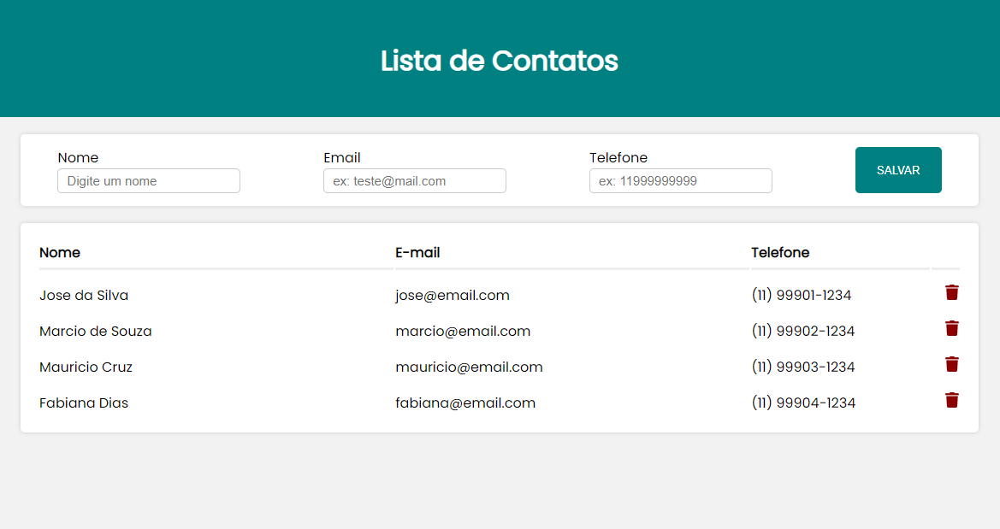

    <h2 align="center"> Contact List </h2>
    

  

## :pushpin: About

A very clean and smooth contact list made with <a href="https://legacy.reactjs.org/">ReactJS!</a> 

The Features include listing all contacts, adding and deleting contacts from the list. You can save your contact's name, email, phone.

The application has validations of forms made with the <a href="https://react-hook-form.com/api/">React hook form</a> and <a href="https://zod.dev/">Zod</a>. 

Use the application with vercel: <a href="https://contact-list-two-rust.vercel.app/">Contact List</a>

## :pushpin: Installation

In the project directory, you can run:

### `yarn`

To load project dependencies.

### `yarn dev`

Runs the app in the development mode.\
Open [http://localhost:5173](http://localhost:5173) to view it in your browser.

The page will reload when you make changes.\
You may also see any lint errors in the console.
